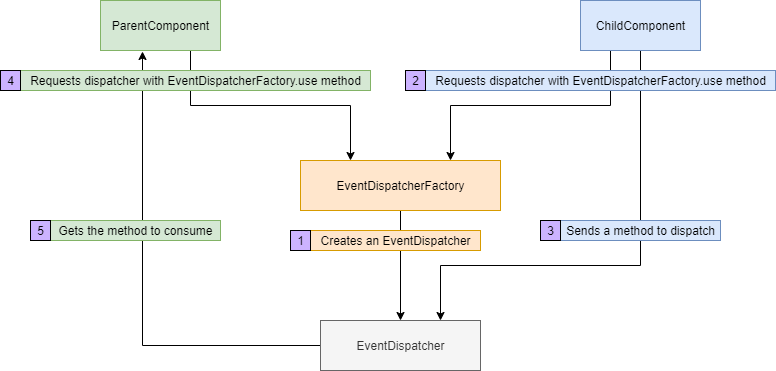

<div align="center">
	<br>
        
	<br>
</div>

<br>

[](https://www.gnu.org/licenses/gpl-3.0) [](https://badge.fury.io/js/react-event-dispatcher) [](https://codecov.io/gh/MuhammedBeraKoc/react-event-dispatcher) [](https://travis-ci.org/MuhammedBeraKoc/react-event-dispatcher) [](https://gitter.im/react-event-dispatcher/community?utm_source=badge&utm_medium=badge&utm_campaign=pr-badge)

<br>

# [Live Demo](https://codesandbox.io/s/crazy-mahavira-miooz?file=/package.json)

## What's New?
Version | Features
------------ | -------------
1.8.3 | - Removed unnecessary files and folders<br>- Created a gitter room for the project
1.8.1 | - Travis CI automation is passing now
1.8.0 | - Main architecture has been redesigned 🌌<br> - `__$` event map removed. Instead each `EventDispatcher` uses a local `_componentEventMap`<br>- `EventDispatcherFactory` class is added. It is the default export now<br>- `name` property added to `EventDispatcher`<br>- `keyNotFoundError` changed as `componentNameNotFoundError` and `deleteKey` as `deleteComponent`<br> - [Travis CI](https://travis-ci.org/) integrated for the project
1.7.6 | - `resolveOne` and `resolveAll` methods are added to `EventDispatcher`<br> - `triggerOne` and `triggerAll` are deprecated now. Use `runOne` and `runAll`
1.7.5 | - `print` method added to `EventDispatcher`<br> - Reimplemented the `EventDispatcher` methods to remove subtle typing errors
1.7.4 | - `keyNotFoundError` error added to the `EventDispatcher`<br> - `deleteKey` method added to `EventDispatcher`
1.7.2 | - First stable version ✔ <br> - Changed babel packages to @babel<br> - Renamed the main class as `EventDispatcher`<br> - `emit` method replaced by `dispatch`<br> - Implemented unit tests for current methods via [Jest](https://jestjs.io/) <br> - Added a live demo to the CodeSandbox

<br>

## What does this library offer?
- **Minimal**: It is a tiny yet crucial library for creating React apps in a much more faster and safer way.
- **Pure Abstraction**: It is so abstract that it doesn't even depend on react module. That means you can use it in any script too.
- **Fully Documented**: The project is well documented and has comprehensive unit tests.

## How to install? 📦
Since the package is in npm you can use the command below to add it to your project packages:

``` bash
npm i react-event-dispatcher
```

## How to use? 🚀
In your React file you have to import it in ES6 syntax:

``` js
import EventEmitter from 'react-event-dispatcher'
```

Now you have full access to the library. Cheers! Let's try it with a basic example:
``` js
const eventToDispatch = () => console.log('It really works 👌')
EventDispatcher.dispatch('RandomComponent', eventToDispatch)
EventDispatcher.runOne('RandomComponent')
// You should see 'It really works 👌' on your console.
```

## A Complete Example

``` js
// Written in Node
const EventDispatcherFactory = require('react-event-dispacther')
const myDispatcher = EventDispatcherFactory.create('MyDispatcher')

class ParentComponent {
	constructor() {
		this.updateChildName = myDispatcher.getOne('$child')
	}
}

class ChildComponent {
	// Assume that this._name is private
	constructor() {
		this._name = '@ChildComponent'
		// In React you don't need to bind
		// Just create a method in Component with arrow 
		// function since it is already bound to this
		const updateName = function(name) {
			this._name = name
		}.bind(this)
		EventDispatcherFactory.use('MyDispatcher').dispatch('$child', updateName)
	}

	get name() {
		return this._name
	}
}

const childComponent = new ChildComponent()
const parentComponent = new ParentComponent()
parentComponent.updateChildName('@AwesomeComponent')
console.log({
	name: childComponent.name
})
```
``` bash
# output
{ name: '@AwesomeComponent' }
```

## Motivation and Architecture
### Motivation
I have been working on React quite lately. And one of the problems I had encountered a lot is event propagation between miscellaneous components. At some point it had been so cumbersome that I had to left some of the projects that I have been dedicated for. So I wrote this minimal yet efficient library for React.

### Architecture
Since version `1.8.0`, the main architecture has been changed drastically. The architecture schema is like below:



</br>

## Contributing
Pull requests are welcome. For major changes, please open an issue first to discuss what you would like to change. Also you can help me to improve the library by joining my [Gitter room](https://gitter.im/react-event-dispatcher/community?utm_source=share-link&utm_medium=link&utm_campaign=share-link) and sharing your ideas about it.

</br></br>

# API 🗄️

## EventDispatcher

### ***dispatch***(componentName: *string*, $functionSet: *Function[]*): *void*
Dispatches the given function set to `_componentEventMap`.

### ***getOne***(componentName: *string*, index: *number*): *Function*
Gets the function with the given componentName and index. Default index value is 0. When it fails to find the function (either componentName is absent or index is larger than the function set) it returns a function which throws `ComponentNotFoundError` and prints the error to the console.

### ***getAll***(componentName: *string*): *Function[] | Function*
Gets the function set with the given componentName. It behaves the same as `getOne` when `componentName` is not found.

### ***triggerOne***(componentName: *string*, index: *number*, ...args: *any[]*): *any*
🚨 **Warning**: Deprecated. Use `runOne`.<br>
Nearly the same of `getOne`. The only difference is it runs the function instead of returning it. It takes a extra argument as args which parameters to be injected in the target function. Returns the return value of the function.

### ***triggerAll***(componentName: *string*, argsSet: *any[][]*): *any[]*
🚨 **Warning**: Deprecated. Use `runAll`.<br>
Same as `triggerOne`. However instead of running one function it runs a function set with the given argument set. Returns the value set of run functions.

### ***runOne***\<T\>(componentName: *string*, index: *number*, ...args: *any[]*): *\<T\>*
🚨 **Warning**: Generics only supported with files using // @flow<br>
Generic version of `triggerOne`.

### ***runAll***(componentName: *string*, argsSet: *any[][]*): *any[]*
Same as `triggerAll`.

### ***resolveOne***\<T\>(componentName: *string*, index: *number*, ...args: *any[]*): *Promise\<T\>*
Promise version of `runOne`.

### ***resolveAll***(componentName: *string*, argsSet: *any[][]*): *Promise<any[]>*
Promise version of `runAll`.

### ***deletecomponentName***(componentName: *string*): *void*
Deletes the given componentName from componentName map. Only recommended to be used in `componentWillUnmount`.

### ***print***(isTest: *boolean*): *void | string*
If `isTest` is false, prints the `__$` as a visual tree. Otherwise it returns the output string for unit testing.

### ***clear***(): *void*
Clears the event map `__$`.

### ***name***(): *string*
Gets `_name` property

## EventDispatcherFactory

### *static* ***create***(dispatcherName: string): *EventDispatcher | Function*
Creates a new EventDispatcher using the `dispatcherName` then returns it. Returns and error function that throws `DispatcherNameIsNotUniqueError` if name is not unique.

### *static* ***use***(dispatcherName: string): *EventDispatcher | Function*
Returns the EventDispatcher with the given name. If name has not found in map, returns a function which throws `DispatcherNotFoundError`.

### *static* ***delete***(dispatcherName: string): *void | Function*
Removes the EventDispatcher with the given name. Return a function that throws `DispatcherNotFoundError` in case name is not in `_eventDispatcherMap`.

### *static* ***print***(): *void*
Prints `_eventDispatcherMap` as a visual tree.

### *static* ***clear***(): *void*
Clears the `_eventDispatcherMap`.